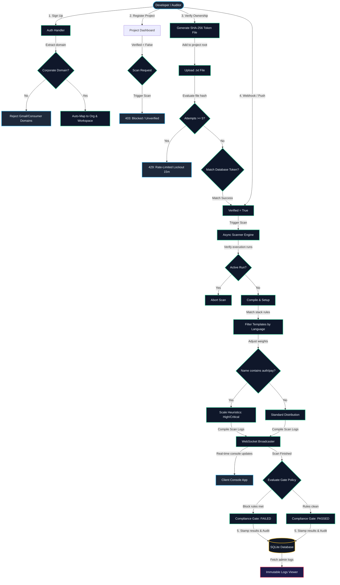

# 🛡️ SecureWay — SaaS Cybersecurity & CI/CD DevSecOps Scan Simulator

SecureWay is a state-of-the-art interactive SaaS simulator platform designed to help security engineers, developers, and compliance managers understand, execute, and monitor DevSecOps pipelines, static application security testing (SAST), and software composition analysis (SCA) workflows in real-time.
---

## 🗺️ System Architecture & Workflow Process

Below is the end-to-end visual workflow of SecureWay—from user registration domain isolation, repository cryptographic verification gates, async WebSocket scanner loops, name-based priority heuristics, to policy evaluation checkpoints:



---

## ✨ Key Features & Capabilities

### 🏢 1. Domain-Based Auth & Workspace Safeguards
* **Auto-Organization Mapping**: Automatically extracts organization domains from email addresses upon registration. Public domains (Gmail, Yahoo, Outlook, etc.) are strictly rejected.
* **Workspace Guardrails**: Prevents workspace lockout. Enforces database safeguards to ensure an organization always has at least one active administrator.

### 🔑 2. Project Ownership Verification
* **Cryptographic Token Verification**: Generates a unique SHA-256 token that developers must include in a `.txt` file inside their repository to verify project ownership.
* **Scan Gating**: Prevents scan executions on unverified repositories.
* **Brute-Force Protection**: Restricts token validation to a maximum of 5 attempts before enforcing a 15-minute rate-limit lockout.

### 🚀 3. Smart Scan Engine
* **Contextual Scanning**: Analyzes and selects security templates tailored dynamically to the repository's stack/language (e.g., Go, JavaScript).
* **Keywords Heuristics**: Project name sensitivity keywords (e.g., `auth`, `payment`, `secret`) automatically scale vulnerability threat weightings towards High & Critical.
* **Resolved-State Cache**: Reduces alert fatigue by applying a 90% repeat-suppression rate on vulnerabilities previously resolved/ignored by the user.

### 🚧 4. Customizable Compliance Gate Policies
* **Dynamic Gate Rules**: Allows admins to configure custom gate block levels (e.g., block pipeline on Critical, High, or excessive Medium threats).
* **Compliance evaluation**: Freezes and stamps the final pipeline result directly onto the scan job details for future compliance audits.

### 📜 5. Immutable Security Audit Trail
* **Workspace Visibility**: Records user sign-ins, verification attempts, scanner webhooks, role changes, and authorization denials.
* **Query Filters**: Fully paginated log explorer equipped with date-range filters, action tags, and actor parameters.

### 📊 6. Real-Time Observability Console
* **WebSocket Broadcaster**: Streams scanning stage changes, percent status, and CLI logs in real-time to all connected workspace members.
* **Exponential Backoff Reconnect**: Automatically re-establishes dropped connections, complete with warning banners in the UI console.
* **Premium Dashboard & Analytics**: Interactive charts showing vulnerability distributions, daily trend lines, and codebase threat density.

---

## 🛠️ Technology Stack

* **Backend**: Go (Fiber v2), SQLite (via pure-go `github.com/glebarez/sqlite` driver for seamless cross-platform support without GCC dependencies), GORM, JWT.
* **Frontend**: Next.js, React, Tailwind CSS, Zustand (state-management), Recharts (graph plotting), Lucide React (icons).
* **Communication**: WebSockets (real-time progress, log streams, alerts broadcasting).

---

## ⚡ Getting Started

### Prerequisites
* Go 1.21+
* Node.js 18+ & npm

### Installation & Launch

You can launch both the frontend and backend servers concurrently using the provided PowerShell script in the root directory:

```powershell
./start.ps1
```

Or run the subsystems individually:

#### 📦 Start Fiber Go Backend
```bash
cd backend
go run main.go
```
*Backend server runs on:* `http://localhost:8080`

#### 🌐 Start Next.js Frontend
```bash
cd frontend
npm install
npm run dev
```
*Frontend console runs on:* `http://localhost:3000`

---

## 🧪 Phased Features Verification

To verify all Phased Features end-to-end (Domain-Based Auth, Safeguards, Ownership verification rate-limit lockout, Smart WebSocket scans, Gate policies, and Audit logs), run the automated integration test script:

```bash
node test_all_features.js
```
